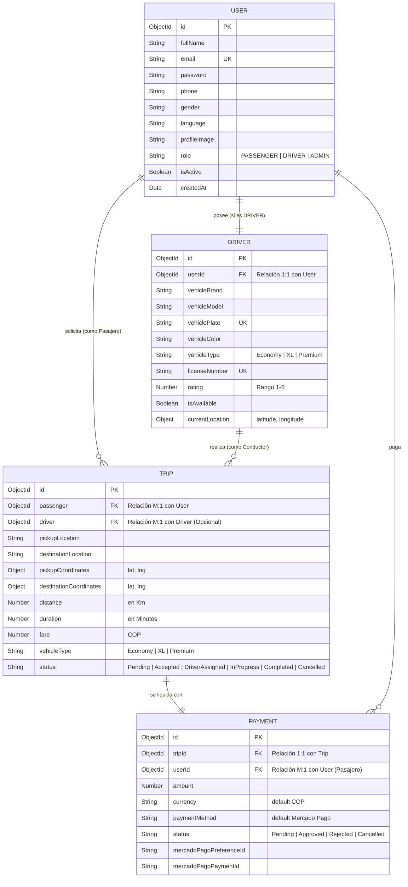
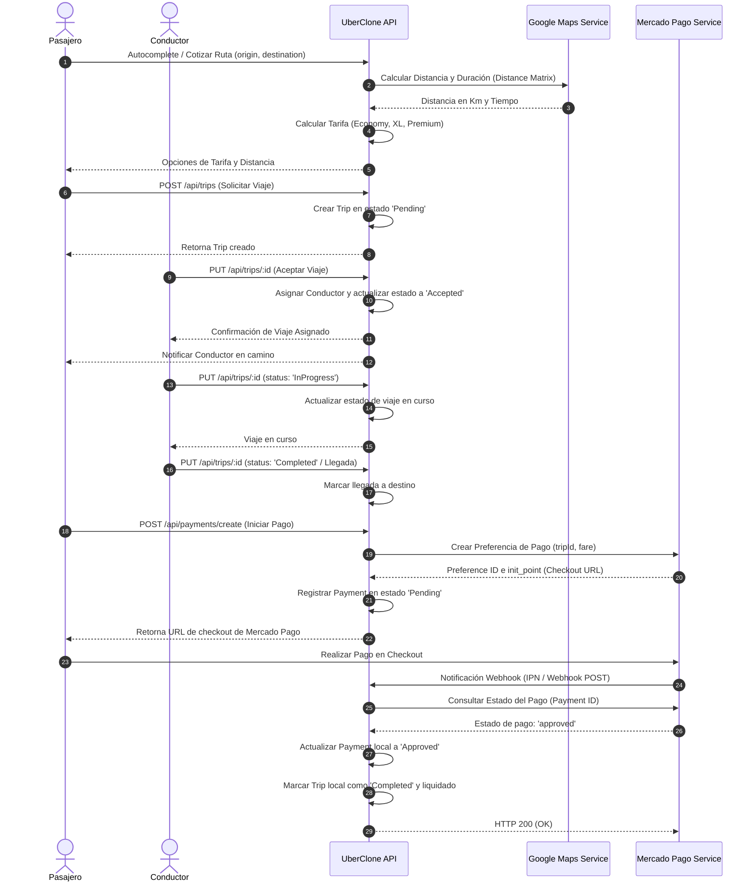

# Arquitectura y Diseño del Sistema UberClone API

Este documento contiene la arquitectura de capas, modelos de datos, flujos de secuencia y diagramas de entidad-relación de la API de **UberClone**.

---

## 1. Diagrama Entidad-Relación (ERD)

El siguiente diagrama detalla la relación lógica entre las colecciones de la base de datos de MongoDB Atlas.

---

## 2. Flujo de un Viaje (Secuencia)

A continuación se ilustra el ciclo de vida completo de un viaje solicitado por el pasajero y aceptado por el conductor, finalizando con el pago.

---

## 3. Arquitectura de Capas Utilizada

El diseño de software sigue estrictamente una arquitectura por capas desacoplada:

1. **Modelos (Mongoose):** Definen la estructura estricta de las entidades y se comunican con MongoDB Atlas.
2. **Servicios (`/services`):** Encapsulan la lógica de negocios aislada y la integración con APIs de terceros (Google Maps SDK, Mercado Pago SDK). Cuentan con un diseño robusto de **Mocks fallback** para permitir el desarrollo continuo y pruebas locales completas sin depender de claves de API externas vigentes.
3. **Controladores (`/controllers`):** Coordinan los flujos HTTP de entrada y salida, procesando la solicitud, invocando la lógica de negocio y enviando respuestas estandarizadas.
4. **Middlewares (`/middlewares`):** Capas intermedias que resuelven autenticación (JWT), control de accesos por roles (Role Authorization), validaciones sintácticas con `express-validator` y manejo centralizado de excepciones (Error Middleware).
5. **Rutas (`/routes`):** Exponen los endpoints de la API y orquestan qué middlewares y controladores responden a cada verbo HTTP.
